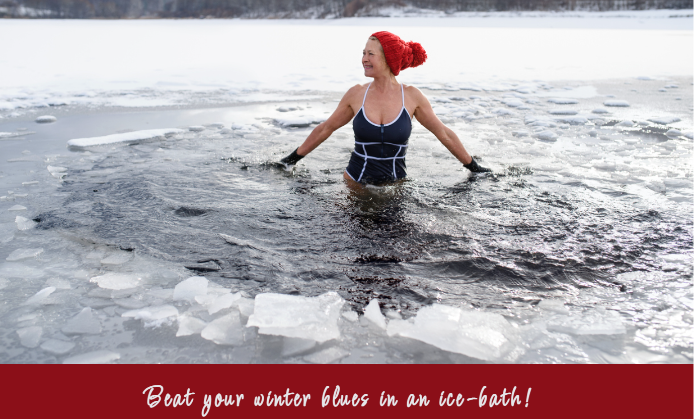
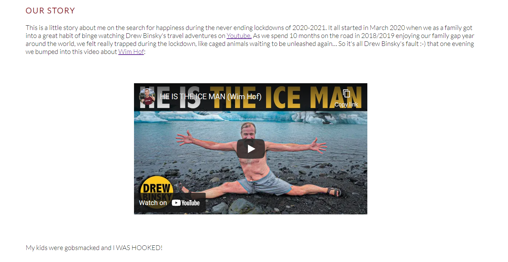
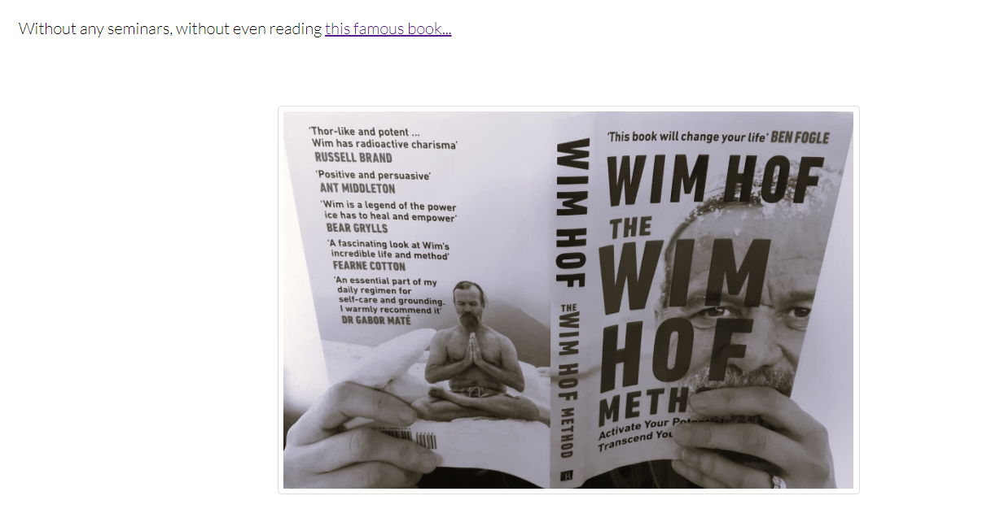
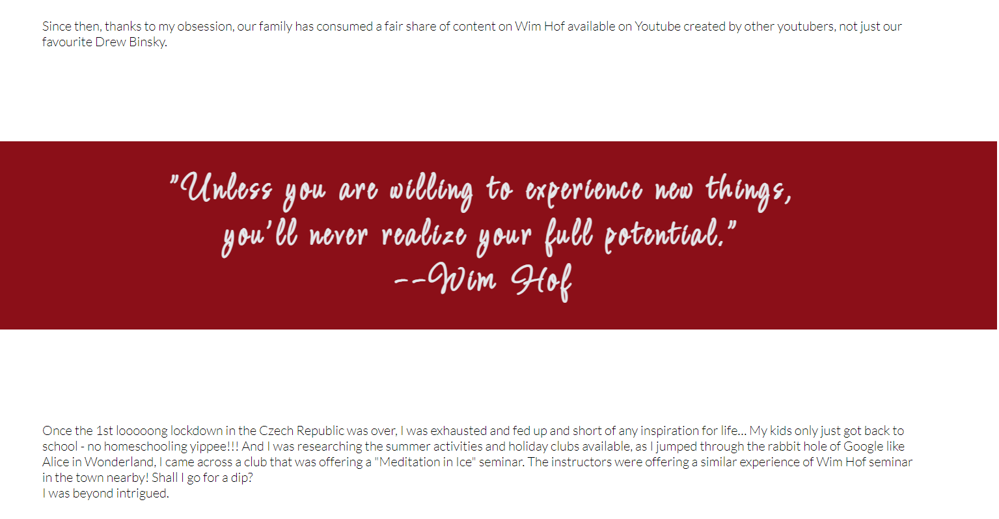
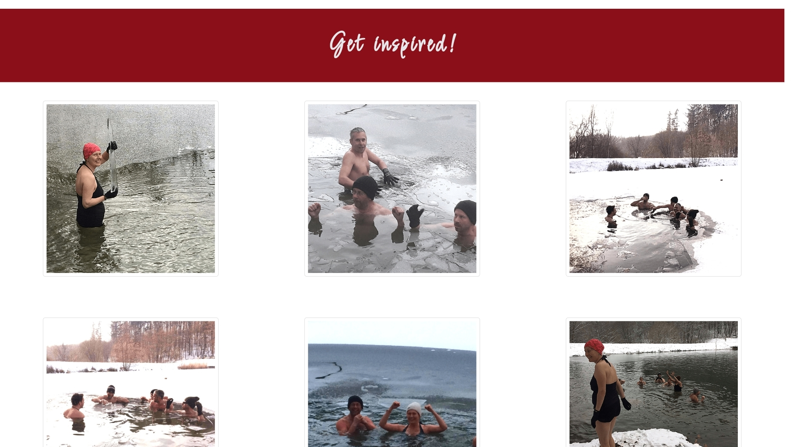
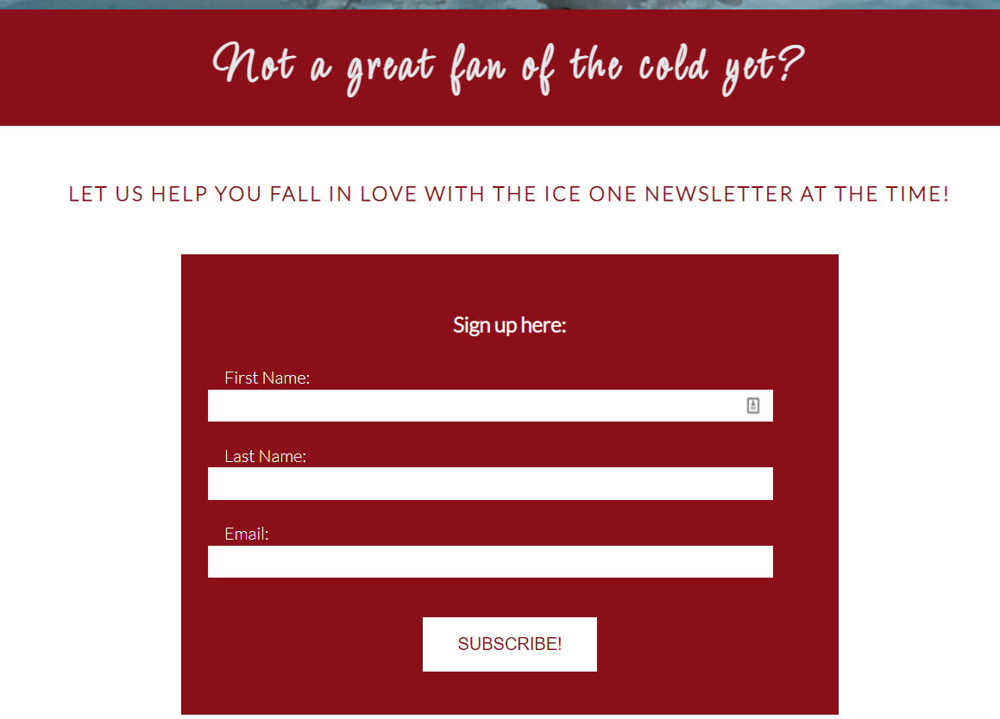
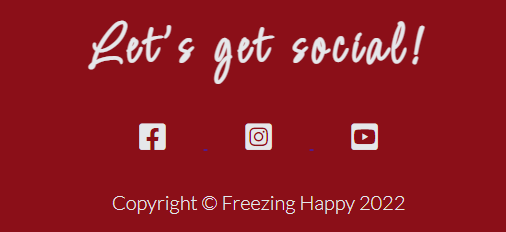
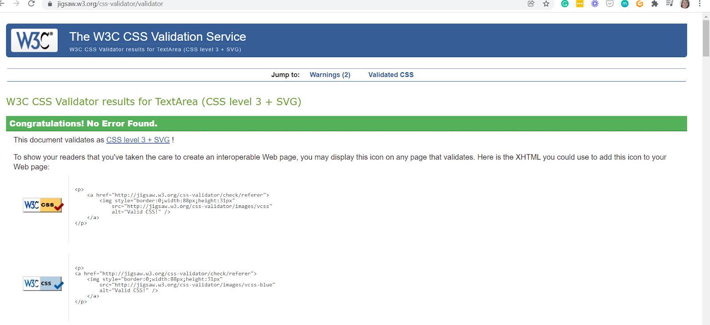
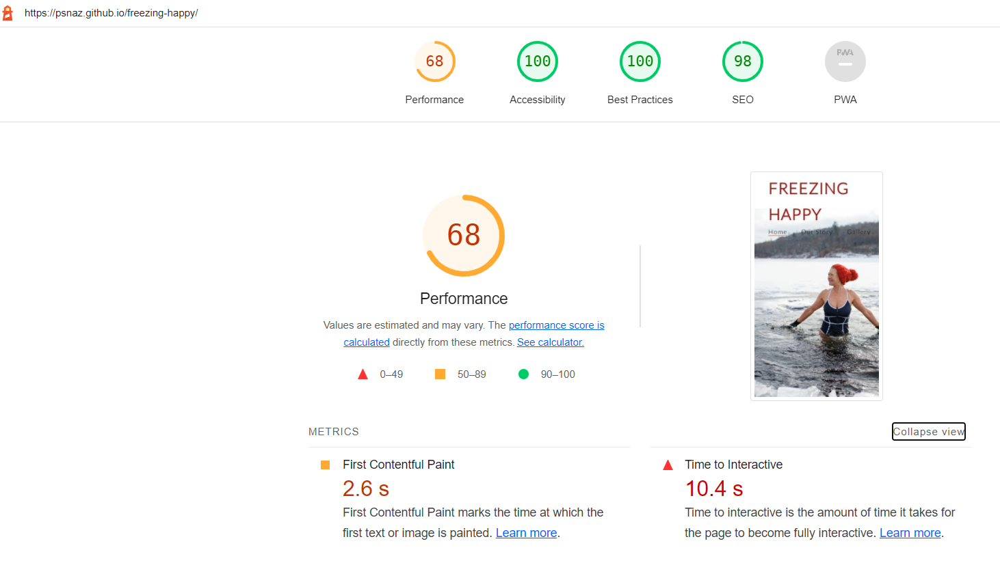

# Freezing Happy
 
The purpose of Freezing Happy is to inspire people to invest time in their health and regular self-care, to work on their immunity and potential, and also to spend more time outdoors by practising so-called Wim Hof Method and open water swimming.

This website is designed to be responsive and accessible on a range of devices, making it easy to navigate for the audience.

## Showcase

A deployed link to the website can be found [here](https://psnaz.github.io/freezing-happy/).

## Features

Freezing Happy is a one page website.

### Navigation Bar

- The responsive navigation bar includes links to Home page, Our Story, Gallery, Sign Up and Contact.
- This section is linked to other relevant sections of this one page website which allows the user to navigate through the page easily.

### The Landing Page Image

- The landing page includes an eye-catching photograph of a middle aged lady taking an ice-bath in a frozen lake and an attention grabbing tagline placed on the ‘red banner’.

### Our Story Section

- This section tells an authentic personal story and creates connection with a reader that is being introduced to the Wim Hof Method. This is also facilitated by the featured YouTube video ‘The Ice Man’ and the image of the Wim Hof book itself.
- These should spark interest of the reader and encourage her to consider ice-baths and cold therapy as a viable way to work on her self-care and immunity.

- The section is naturally devided by a motivational quote placed on a decorative red banner. 

### Get Inspired or The Gallery Section

- The gallery should showcase how the Wim Hof Method is practised regularly and the maind purpose is to inspire the reader so that she can start thinking outside the box about pushing her personal bounderies.

- Part of this section is also a friendly invitation to join the group, inclduding the day, time and location of the meet up and a list of practical items to be brought along.

### Sign Up

- The Sign Up section encourages the reader to stay in touch via newsletter and subscribscribe.
- The reader is asked to submit their full name and email address.

### Contact

- This section gives the reader opportunity to get in touch if they have questions.
- Contact details: email and telephone numbers are provided.

### The Footer

- The footer section includes a friendly phraze encouraging follow on social media.
- It includes social media icons with links to Facebook, Instagram and YouTube.
- It also includes copyright statement at the very bottom.

## User Experience (UX)

### User Stories

The target audience (end users) of this project are predominantly females (but also males) from the age of 30+ looking for information about practicing the so-called 'Wim Hof Method', ice baths, cold therapy and open water swimming. It is aimed at this type of audience as my personal story ('mum of two trying to survive lockdowns and maintain some sanity during the pandemic') can resonate with them.

The end user is looking for inspiration and credibility of the Wim Hof Method.

The benefit of this project is to highlight that “ordinary people” can push their personal boundaries, create extraordinary outdoor experiences while increasing their physical and mental health and fitness at the same time. 

Other features that are not to be missed is that the user can, if they wish, get in touch to obtain more information about the regular ice-baths and open water swimming meetups, possibly join the group if they’re local, subscribe to the newsletter and easily navigate to the social links.

- As an end user I want to get inspired to try out the Wim Hof Method to find content about the ice-baths, cold therapy, open water swimming, and their benefits.
- As an end user I want to find all this information easily, without too many clicks.
- As an end user I want to be able to subscribe to the newsletter so that I can receive more regular updates on the Wim Hof Method in practice and regular meetups of the group. 
- As an end user I want to be able to find website owner's contact details and social links, so that I could get in touch and follow easily.
- As an end user I want to be able to view this information on a variety of devices: a desktop, mobile phone and tablet.

## Strategy

### Steps Taken

- Project ideas jotted down in a notepad and a mind map created (pen & paper)
- Hero image searched for on pixabay.com, but found on iStock
- Content page outlined, researched and written in Google docs
- Color palette created in canva.com
- Wireframe design created in canva.com
- Planning Session 1 with my mentor (Call 1)
- GitHub repository created, link [here](https://github.com/psnaz/freezing-happy).
- Project broke down into smaller tasks and To-Do List created in Google docs
- README file content outlined and written in Google docs
- Building work/ Coding started in Gitpod
- Project Session 2 with my mentor (Call 2)
- Building work/ Coding continues and amendments carried out
- Project Session 3 with my mentor (Final Call)
- Project finalized, tested, bugs fixed
- Project submitted to the Code Institute for marking

## Technologies Used

### Languages Used
- HTML5
- CSS3

### Frameworks, Libraries and Programs Used

- [Pixabay.com](https://pixabay.com/): Pixabay was originally used to find images but images found thanks to iStock ad placed on the site
- [Canva.com](https://www.canva.com/): [Canva Color Palette Generator](https://www.canva.com/colors/color-palette-generator/) was used to create [my color palette](https://docs.google.com/document/d/e/2PACX-1vQFfVufLElq5SqE56QDL7nFfoI3bhFWDxp9opZS1hYrAaxy3xVWU4ntsD4DvSYZcEZgi_9Ez7hbboe5/pub) and Canva was used to create [my wireframe design](https://drive.google.com/file/d/1eJwBfbEYS5F_1b5bzXBn2bcpLrGb8VKd/view?usp=sharing), and for resizing and editing images.
- [Google Fonts](https://fonts.google.com/): Google fonts were used to import the ‘Lato’ and 'Licorice' fonts into the style.css files. My favourite font Lato was used throughout the project, Canva font 'Inspiration' was not available on GoogleFonts, therefore was replaced by the font 'Licorice' and used on banners for decorative purposes.
- Git: Git was used for version control by utilizing the Gitpod terminal - to commit to Git and push to GitHub
- GitHub: Github is used to store the project's code after being pushed from Git.
- GoogleDev Tools used to see the element positioning and responsiveness
- [TinyPNG](https://tinypng.com/) was used to compress the images
- [FontAwesome](https://fontawesome.com/) used for social media icons: FB, IG, YT

## Credits

### Code

- The majority of the code came from the Diploma in Software Development study materials, my notes taken during going through the materials and by working with Google DevTools - trial and error approach.

- [MDN Web Docs](https://developer.mozilla.org/en-US/): Used extensively to deepen my knowledge and understanding of HTML and CSS, and chek for ideas and solutions, specifically:  

- Mentor’s advice: As per my mentor's advice I used flexbox as the main element to create the gallery that looks a little bit like Instagram feed.

- Code Institute [template for Readme file](https://github.com/Code-Institute-Solutions/readme-template) followed.

- Flexbox resources studied and followed: [How to Create a Responsive Gallery with Flexbox](https://www.developerdrive.com/responsive-image-gallery-flexbox/) and A [Complete Guide to Flexbox](https://css-tricks.com/snippets/css/a-guide-to-flexbox/).  

### Content

- All content was written by the developer.
- Wim Hof quotation found on his Twitter [here](https://twitter.com/iceman_hof/status/1163496295723651074?lang=en).

### Media

- 2 images (hero image “lady in the red hat” and “lady’s legs”) purchased on [iStockphotography.com](https://www.istockphoto.com/)
- The rest of the images created by the developer.
- Youtube video “HE IS THE ICE MAN (Wim Hof)” created by Drew Binsky.

### Acknowledgements

- My ice-bath-crazy friends for inspiration and getting me hooked on ice baths, cold therapy and open water swimming.
- My Mentor Celestine Okoro for his helpful feedback.
- Tutor support at Code Institute for their support, in particular, I'd like to thank you Ed, Jo and Igor.
- Stephen Seagrave, CI alumni, for his most valuable advice recorded as [Milestone 1 Planning with Stephen Seagrave](https://youtu.be/06tXTbm-DxI).
- Code Institute Slack Community for all their advice and support.

## Testing

The W3C Markup Validator and W3C CSS Validator Services were used to validate the project page to ensure that there were no syntax errors in the project.

W3C Markup Validator - Results are available [here](https://docs.google.com/document/d/12D5-xRJ7aznZ0yA9dGJkFYGP2j3VgLC9DlVKVzriH5o/edit?usp=sharing).

W3C CSS Validator - Results are available [here](https://docs.google.com/document/d/1sy53L79voZqkRTRMqF7R4Q9mz8OxifBSCjdpKFMWaEg/edit?usp=sharing).

This Website was also tested by Lighthouse Chrome Extension and the full report is available [here](https://docs.google.com/document/d/1D0csh9chky472govAPuKJa73MZPxRlj16xuiBu79ltk/edit?usp=sharing).

## Unfixed Bugs

Please see the test reports attached. The mentioned bugs have not been fixed due to time constraints - the timely submission of my project would be seriously geopardised.

## Deployment

This site was deployed to GitHub pages by taking the following steps:

1. In the GitHub repository click on the settings tab on the right hand site
2. Scroll down to the GitHub pages heading that informs you that 'Pages setting now has its own tab' and click on the link next to it.
3. Select source and select 'main' and save, this will refresh the page.
4.  Scroll down to the GitHub Pages section again to see the deployed link and click on it.
5. Please note that it might take a few minutes for Github to build the site.

## Forking the GitHub Repository OR Making a Local Clone

If you are interested how to fork this repository or how to make a local clone, this information can be found in Github documentation [here](https://docs.github.com/en/repositories/creating-and-managing-repositories/cloning-a-repository).

## Notes

I have also taken inspiration from the following sales pages I previously created for my client Healing Spot PT in their Kartra acc. Please note that I have not inspected the below pages with GoogleDev Tools nor tried to find out what the code for these pages is, I simply took inspiration from the graphic design point of view.

- [Clear Your Root Online Program](https://healingspot.kartra.com/page/Clear-Your-Root)
- [Release Your Root Online Program](https://healingspot.kartra.com/page/Release-Your-Root)
- [Low Pressure Fitness Online Program](https://healingspot.kartra.com/page/Low-Pressure-Fitness-Level1)
- [Rise-N-Shine Self-care Program](https://healingspot.kartra.com/page/Rise-n-Shine)
- [How Smart Moms Return To Exercise Class](https://healingspot.kartra.com/page/how-smart-moms-return-to-exercise)

